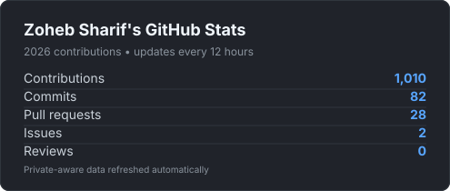

<h3 align="center">
  
</h3>

  <strong>I am Zoheb Sharif</strong>

  <i>Currently building things with agents, AI, and cloud infrastructure.</i>

  <a href="mailto:sharifzoheb@gmail.com">Email</a> —
  <a href="https://zohebsharif.com">Website</a> —
  <a href="https://linkedin.com/in/zohebsharif">LinkedIn</a>

 

## GitHub Stats

  

 

## Activity

  

 

## LeetCode

  

<!-- Machine-updated totals (text) -->
<!-- LEETCODE:START -->
<!-- LEETCODE:END -->
